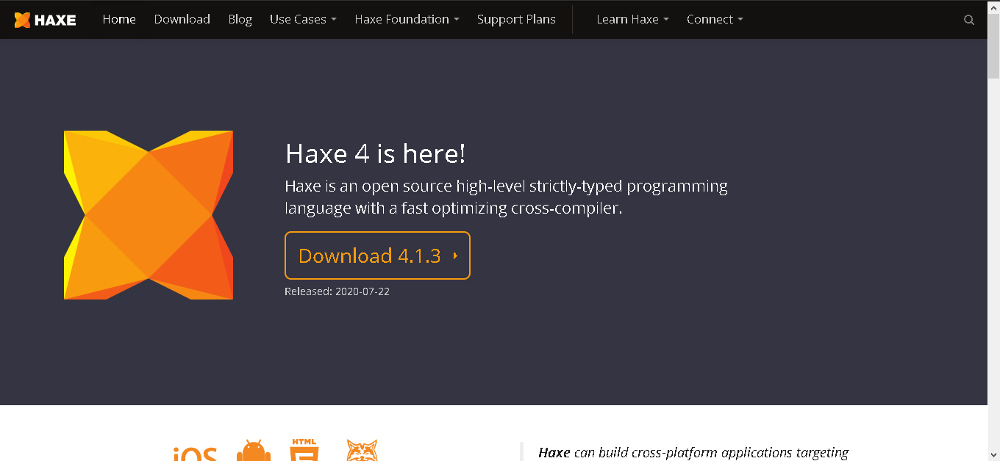
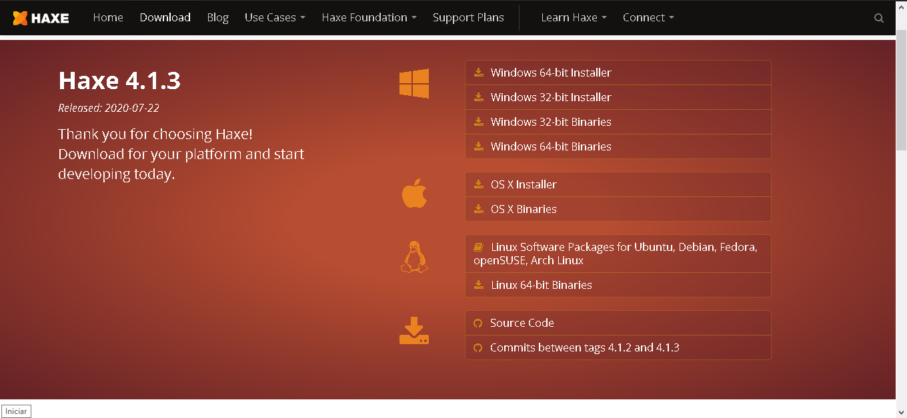

<p align="center">
  
</p>

Trabalho para as aulas de Linguagem de Programação 2º Semestre
2020 sobre a Linguagem Haxe. A pesquisa foi feita focando na história da
linguagem, sintaxe e semantica.

<p align="center">
  
</p>

## Alunos integrantes da equipe

* Daniel Santos França
* Hamon-Rá Taveira Guimaraes
* Matheus Felipe Santos Bussolotti

## Professores responsáveis

* Hugo Bastos de Paula


>[Haxe] é uma linguagem de alto nível, open-source, cross-platform compilada, sendo ela traduzida para várias outras linguagens.
A linguagem inclui uma gama de bibliotecas base dando suporte para todas as plataformas que possam ser compiladas, sendo esse suporte para tipos numéricos, strings, listas, files e muitos outros.

>Haxe foi originalmente uma ideia para dar suporte tanto para o lado do cliente e servidor unificando várias ferramentas escritas em linguagens diferentes sendo elas Javascript, C++, Java, PHP.

#### As linguagens suportas por Haxe

| Compiler target | Output | Platform | Use | Since Haxe version
| ------ | ------ | ------ | ------ | ------ |
| JavaScript | source | HTML5, NodeJS, PhoneGap | Server, desktop, browser, mobile |2006
| C++ | source | Windows, Linux, MacOS, Android, iOS, Palm, WebOS | Server, desktop, Mobile, CLI, game consoles | 2009 (2.04)
| PHP | source | PHP | Server | 2008 (2.0)
| C# | source | .NET Framework | Server, desktop, mobile |      2012 (2.10)
| Java | source | Java | Server, desktop | 2012 (2.10)
| JVM | bytecode | Java virtual machine | Server, desktop | 2019 (4.0)
| Python | source | Python | CLI, web, desktop | 2014 (3.2)
| Lua | source | Lua | CLI, web, desktop, mobile | 2016 (3.3)
| Neko | bytecode | NekoVM | Server, desktop, CLI | 2005
| Flash/SWF | bytecode | Adobe Flash Player 9+, Adobe AIR, Tamarin | Desktop, browser, server | 2005
| HashLink | bytecode | HashLink VM or HL/C (compile to C file) | Server, desktop, mobile, game consoles (C export) | 2016 (3.4)

### Para mais informações vá em ```Documentacao/```

# Instalação
- Vá no site [Haxe] e clique em "download"



- Escolha o instalador para a sua plataforma e baixe.



- Instale normalmente seguindo as instruções do instalador.

[Haxe]: <https://haxe.org/>

## Algumas características da linguagem
| Language Features | description
| ------ | ------ |
|  | An abstract type is a compile-time construct which is represented in a different way at runtime. This allows giving a whole new meaning to existing types.
|  | Externs can be used to describe target-specific interaction in a type-safe manner.
|  | Data can easily be grouped in anonymous structures, minimizing the necessity of small data classes.
|  | Create and populate arrays quickly using for loops and logic.
|  | Create and populate maps quickly using for loops and logic.
|  | Haxe allows structuring code in classes, making it an object-oriented language. Common related features known from languages such as Java are supported, including inheritance and interfaces.
|  | Conditional Compilation allows compiling specific code depending on compilation parameters. This is instrumental for abstracting target-specific differences, but can also be used for other purposes, such as more detailed debugging.
|  | Structure can be expressed through algebraic data types (ADT), which are known as enums in the Haxe Language. Furthermore, Haxe supports their generalized variant known as GADT.
|  | Functions can be designated as being inline, allowing their code to be inserted at call-site. This can yield significant performance benefits without resorting to code duplication via manual inlining.
|  | Iterating over a set of values, e.g. the elements of an array, is very easy in Haxe courtesy of iterators. Custom classes can quickly implement iterator functionality to allow iteration.
|  | Functions in Haxe are not limited to class fields and can be declared in expressions as well, allowing powerful closures.
|  | Add metadata to fields, classes or expressions. This can communicate information to the compiler, macros, or runtime classes.
|  | Existing classes and other types can be augmented with additional functionality through using static extensions.
|  | Strings declared with a single quotes are able to access variables in the current context.
|  | Any function can be applied partially, providing the values of some arguments and leaving the rest to be filled in later.
|  | Complex structures can be matched against patterns, extracting information from an enum or a structure and defining specific operations for specific value combination.
|  | Variable class fields can be designed as properties with custom read and write access, allowing fine grained access control.
|  | The access control language feature uses the Haxe metadata syntax to force or allow access classes or fields.
|  | Types can be parametrized with type parameters, allowing typed containers and other complex data structures. Type parameters can also be constrained to certain types and respect variance rules.

## Algumas características do compilador
| Compiler Features | description
| ------ | ------ |
|  | Starting from Haxe 3.0, you can get the list of defined compiler metadata by running haxe --help-metas
|  | Dead Code Elimination or DCE is a compiler feature which removes unused code from the output.
|  | 
|  | Haxe provides a simple resource embedding system that can be used for embedding files directly into the compiled application.
|  | The Haxe compiler generates runtime type information (RTTI) for classes that are annotated or extend classes that are annotated with the :rtti metadata.
|  | Haxe 3.3.0 introduces a new static analyzer for code optimizations. It is enabled by using the -D analyzer-optimize compiler flag and consists of multiple modules which can be configured globally with a compiler flag as well as at type-level and field-level with a compiler metadata.
|  | The compiler tries to unroll short iterations of for loops over constant ranges.
|  | Recursion is a natural way to solve some tasks like calculating fibonacci numbers or traversing trees. It's easy to write, read and understand. But it takes more computational resources at run time than solving the same tasks with loops instead of recursion.
|  | The Haxe compiler offers opt-in compile-time checking for nullable values. It attempts to catch various possible issues with nullable values.


